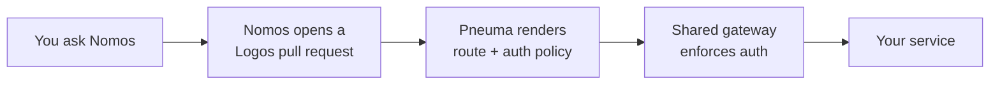

# Expose and Protect a Route

Make a service reachable from outside the platform and choose who may call it. Ask the [Nomos Agent](/onboarding); it collects the details, validates them, and opens the pull request. Pneuma then renders the gateway routing and authentication. How the gateway works is documented for owners in [Service Mesh](../platform-grouping/pneuma/service-mesh.md) and [Gateway Authentication](../platform-grouping/pneuma/gateway-authentication.md).



## Before You Ask

- Your team has a DNS subdomain and a namespace enrolled in the mesh. Nomos can add both.
- Your workload has a `Service` in that namespace that listens on the port you will give.

## What to Tell Nomos

```text
Expose the api service in the api namespace of st-ethos on port 8080 at /api.
Require browser sign-in for the platform-engineers group, and keep /api/healthz public.
```

| Nomos asks for | Notes |
| --- | --- |
| Service, port, path prefix | Path defaults to `/`. The hostname is always your team subdomain, so `st-ethos` serves `ethos.osinfra.io/api`. |
| Authentication mode | `public`, `browser` (default), or `api-jwt`. |
| Groups or roles | Required for `browser`; optional for `api-jwt`. Authentik groups and application roles. |
| Audiences | Required for `api-jwt`: the accepted token audience. |
| Public paths | Optional unauthenticated sub-paths, such as `/api/healthz`. |

## Choose an Authentication Mode

| Mode | Use for | Nomos requires | Nomos rejects |
| --- | --- | --- | --- |
| `public` | An open route | nothing | any groups, roles, audiences, or public paths |
| `browser` | People signing in with Authentik SSO | at least one group or role | audiences |
| `api-jwt` | Machine-to-machine bearer JWT clients | at least one audience | nothing |

Public paths must sit under the route path and cannot be `/`, `/*`, or `*`. `/api/healthz` exempts only that path; `/api/healthz/*` exempts the whole subtree. Route changes take effect on the next Pneuma pipeline run, and you cannot claim another team's hostname.

### Matching Rules

- A request satisfies a list if it carries **any one** value (OR). When you declare groups and roles, it must satisfy **each** list (AND).
- `path` is a prefix: `/api` matches `/api` and everything under it. Enforcement covers the whole prefix except your public paths and the built-in Authentik callback and health exemptions.

### Browser Routes

:::caution One policy per host

Every browser route on your team host must use the same groups and roles. Logos rejects conflicts because Authentik bindings are scoped to the host, not the path. Group **membership** is not yet synced from Logos; see [rollout status](../platform-grouping/pneuma/gateway-authentication.md#browser-authorization).

:::

Your workload receives no JWT. After Authentik authorizes the session, the gateway injects trusted headers: `x-authentik-username`, `x-authentik-email`, `x-authentik-name`, `x-authentik-uid`, `x-authentik-groups`, and `x-authentik-entitlements`. Read only what you need; the gateway already enforces the declared groups and roles.

### API JWT Routes

Requests without a validated JWT, or whose `aud`, `groups`, or `roles` claims do not satisfy the audiences, groups, or roles you declared, are denied at the gateway.

## Verify

1. Merge the pull request Nomos opened and wait for the Pneuma pipeline to run.
2. Request the route. Enforced paths must deny unauthenticated requests (a redirect to Authentik for `browser`, a rejection for `api-jwt`); public paths must respond directly.
3. Inspect the rendered route; `Accepted` and `ResolvedRefs` should both be `True`:

   ```bash
   kubectl get httproute -n st-ethos-api api-ethos -o yaml
   ```

## Troubleshooting

If a route is not served:

1. Confirm the namespace is enrolled in the mesh and the route has the correct service and port.
2. Confirm the backend `Service` exists and listens on that port.
3. Inspect the rendered `HTTPRoute` as above, or ask Nomos to review your team configuration.

If a public path redirects to Authentik, the public path does not match the request path as declared.
