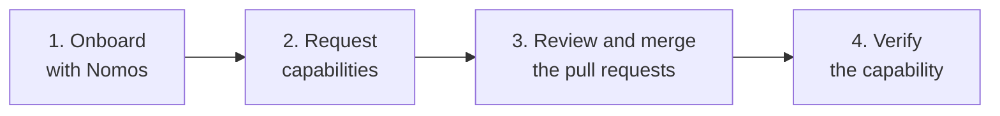

import Card from '@site/src/components/Card';
import CardGrid from '@site/src/components/CardGrid';

# Getting Started

For teams **using** the platform. The platform teams expose one coherent interface: the [Nomos Agent](/onboarding). You only need to know how to ask it for what you need and how to verify the result. How each capability is built and operated is documented for owners under [Platform Grouping](../platform-grouping/index.md).

<CardGrid>
  <Card item={{ icon: '🚀', title: 'Onboard Your Team', note: 'Team, repositories, access, GCP projects, databases, Kubernetes namespaces, and secrets. Nomos opens the pull requests.', link: '/onboarding', linkText: 'Start onboarding →' }} />
  <Card item={{ icon: '🌐', title: 'Expose and Protect a Route', note: 'Serve a service at your team hostname and choose public, browser SSO, or API JWT authentication.', link: '/getting-started/expose-a-route', linkText: 'Ask for a route →' }} />
  <Card item={{ icon: '📚', title: 'Glossary', note: 'Terms used across these guides.', link: '/getting-started/glossary', linkText: 'View terms →' }} />
</CardGrid>

## What Each Team Provides

| Team | You provide | You get | Boundary |
| --- | --- | --- | --- |
| Logos | Team key, purpose, maintainers, members, repositories, optional feature flags | GCP folders and groups, GitHub teams and repositories, Datadog team configuration | You never manage Logos-owned resources directly; changes go through reviewed configuration. |
| Corpus | Environments, APIs, connectivity, DNS, registry, workload identity, managed data needs | Governed projects, Shared VPC, regional networking, delegated DNS, Artifact Registry, CI identities, encrypted state, private service connectivity | You own application configuration; Corpus owns shared networking, KMS, state, and foundational IAM. |
| Pneuma | Workload identity, namespace needs, image location, routes, auth rules, certificate and observability needs | Managed clusters, namespace access, ingress and mesh, gateway authentication, certificates, telemetry, admission policy | You own application manifests; secrets policy belongs to Kryptos. |

## Need Something Else?

| Need | Go to |
| --- | --- |
| Reusable OpenTofu module | [Arche](../platform-grouping/arche/index.md) |
| Workflows, hooks, dev environment, or agents | [Techne](../platform-grouping/techne/index.md) |
| Secrets service or OpenBao policy | [Kryptos](../platform-grouping/kryptos/index.md) |
| Fix or extend these docs | [Documentation](../platform-grouping/ekklesia/documentation.md) |
