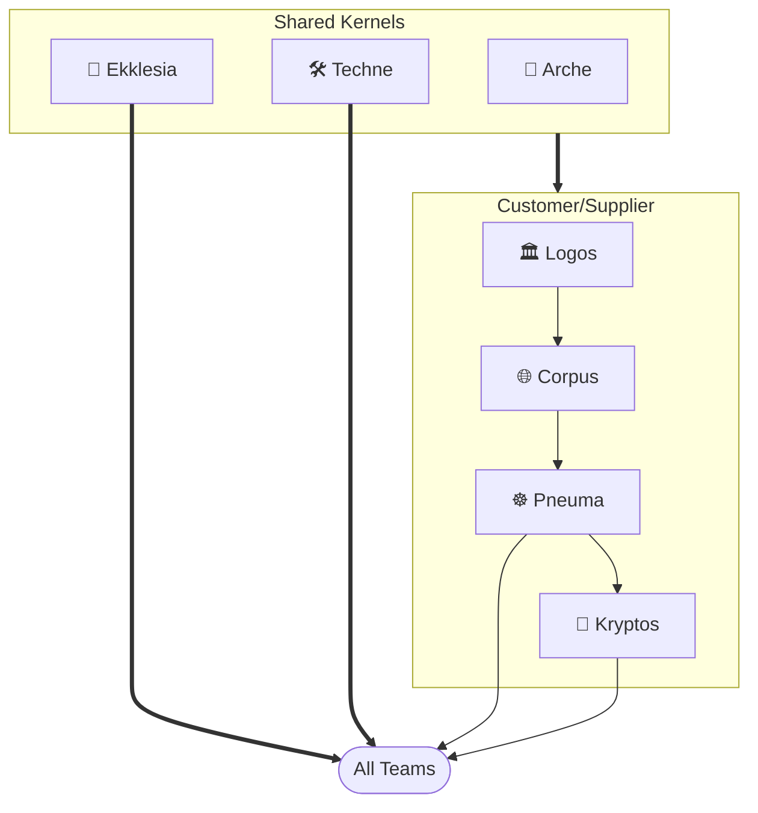

import Card from '@site/src/components/Card';
import CardGrid from '@site/src/components/CardGrid';

# Platform Grouping

The **platform grouping** is the Team Topologies (2nd edition) term for a collection of platform teams that together provide a coherent internal platform product. Each platform team within the grouping owns a distinct bounded context; together they expose a single, coherent interface to stream-aligned teams.

## Teams

<CardGrid>
  <Card item={{ icon: '🏛️', title: 'Logos', note: 'The foundational principle of order across systems — integrating multi-provider infrastructure, establishing boundaries, governance, and stable standards for teams to operate autonomously.', link: '/platform-grouping/logos', linkText: 'Learn more →' }} />
  <Card item={{ icon: '🌐', title: 'Corpus', note: 'The embodiment of that order — the structural form where networks, shared services, and core infrastructure take shape, preparing the body that Pneuma will animate.', link: '/platform-grouping/corpus', linkText: 'Learn more →' }} />
  <Card item={{ icon: '☸️', title: 'Pneuma', note: 'The breath of life animating the platform via Kubernetes — orchestrating dynamic, self-healing, and scalable services atop the Logos foundation.', link: '/platform-grouping/pneuma', linkText: 'Learn more →' }} />
  <Card item={{ icon: '🧱', title: 'Arche', note: 'The origin and first cause — the primordial source from which all platform foundations draw their initial form and essential nature.', link: '/platform-grouping/arche', linkText: 'View modules →' }} />
  <Card item={{ icon: '📖', title: 'Ekklesia', note: 'The assembly of the called-out — where distinct capabilities are gathered into a unified body, deliberating and acting in concert toward shared platform purpose.', link: '/platform-grouping/ekklesia', linkText: 'Learn more →' }} />
  <Card item={{ icon: '🔐', title: 'Kryptos', note: 'The hidden foundation of platform security — managing cryptographic primitives, secrets infrastructure, and security controls that underpin all teams on the platform.', link: '/platform-grouping/kryptos', linkText: 'Learn more →' }} />
  <Card item={{ icon: '🛠️', title: 'Techne', note: 'The practiced art of making — the disciplined craft through which raw materials of infrastructure are shaped into purposeful, refined platform instruments.', link: '/platform-grouping/techne', linkText: 'Learn more →' }} />
</CardGrid>

## Domain-Driven Design

The platform documentation uses Domain-Driven Design (Evans, Vernon) vocabulary precisely. Every team, subdomain, and aggregate page is structured against this mapping:

| DDD concept | Mapping in this codebase |
|---|---|
| Domain | The osinfra-io platform |
| Bounded Context | A platform team — Logos, Corpus, Pneuma, Arche, Techne, Ekklesia, Kryptos |
| Subdomain | A child page of a team (e.g., Pneuma's Cluster Management, Service Mesh) |
| Aggregate | A consistency boundary inside a subdomain — has exactly one Aggregate Root |
| Members | Aggregate Root / Entity / Value Object / Domain Event / Domain Service |

When a sentence on any team or subdomain page says "bounded context", it always means a team — never a subdomain or an aggregate. When it names an aggregate, the aggregate root is called out explicitly and any non-root members appear in a typed table.

## Bounded Context

The platform is organized into bounded contexts — each team owns one with explicit upstream/downstream relationships.

### Context Map

The primary flow is a **Customer/Supplier** chain — Logos supplies team and identity data to Corpus, which supplies networking and project infrastructure to Pneuma.

## Team Topologies

### Interaction Modes

Team Topologies defines three interaction modes — **X-as-a-Service** (consume without collaboration), **Collaboration** (work together temporarily to solve a problem), and **Facilitating** (help another team improve capability). Collaboration is always time-boxed; the goal is to transition to X-as-a-Service once the consuming team is self-sufficient.

| Team | Steady-State Mode | Notes |
|---|---|---|
| <nobr>🏛️ Logos</nobr> | <nobr>🔵 X-as-a-Service</nobr> | Identity groups, GitHub teams, GCP folders, and Datadog teams are provisioned for you via automation |
| <nobr>🌐 Corpus</nobr> | <nobr>🔵 X-as-a-Service</nobr> | GCP projects, shared VPC, state buckets, and workload identity are provisioned for you |
| <nobr>☸️ Pneuma</nobr> | <nobr>🔵 X-as-a-Service</nobr> | GKE clusters and add-ons run for you; Collaboration available during initial cluster onboarding |
| <nobr>🧱 Arche</nobr> | <nobr>🔵 X-as-a-Service</nobr> | Consume child modules via OpenTofu source pins; inner source Collaboration available for contributions |
| <nobr>📖 Ekklesia</nobr> | <nobr>🟢 Facilitating</nobr> | Organizational knowledge hub — architecture decisions, module references, and operational guides for platform and stream-aligned teams alike |
| <nobr>🔐 Kryptos</nobr> | <nobr>🔵 X-as-a-Service</nobr> | Secrets infrastructure and PKI managed for you; no direct interface for stream-aligned teams |
| <nobr>🛠️ Techne</nobr> | <nobr>🟢 Facilitating</nobr> | Reusable workflows and Codespace reduce extraneous load; Collaboration for new tool adoption |

_🔵 X-as-a-Service · 🟡 Collaboration · 🟢 Facilitating_

### Cognitive Load

Team Topologies distinguishes three types of cognitive load — **intrinsic** (inherent domain complexity), **extraneous** (friction from poor tooling), and **germane** (productive expertise-building). The platform is designed to eliminate extraneous load through shared automation (Arche, Techne), so each team's cognitive budget is spent entirely on intrinsic and germane load.

| Team | Working Domains | High Intrinsic Domains |
|---|---|---|
| Ekklesia | 🟢 1 / 4 | 🟢 0 / 3 |
| Techne | 🟢 2 / 4 | 🟢 0 / 3 |
| Arche | 🟢 3 / 4 | 🟢 1 / 3 |
| Kryptos | 🟢 2 / 4 | 🟡 2 / 3 |
| Logos | 🟠 4 / 4 | 🟢 0 / 3 |
| Corpus | 🟠 4 / 4 | 🟢 1 / 3 |
| Pneuma | 🔴 5 / 4 · [ADR →](/platform-grouping/pneuma#pneuma-cognitive-load-mitigation) | 🟠 3 / 3 |

_🟢 within limit · 🟡 approaching · 🟠 at limit · 🔴 over limit_

### Team Capacity

The platform operates as a **platform grouping** — the Team Topologies Second Edition term for a collection of teams or specializations that together provide a coherent internal platform product. Internally, each platform engineer specializes in one bounded context, but externally the platform grouping presents a coherent interface to stream-aligned teams — consistent tooling, documentation, and services regardless of which bounded context delivers them.

Headcount is derived from the cognitive load analysis. When operating within capacity, a bounded context requires one platform engineer to maintain and evolve it. A context approaching or at its limit is a candidate for additional capacity or scope reduction. Any context flagged 🔴 over limit is the highest priority for intervention — either a second engineer, scope reduction, or tooling investment to lower extraneous load.

#### Platform Lead

A single **Platform Lead** spans all teams. This role does not belong to any one team — it exists above them. On this platform, the Platform Lead also serves as the **Product Manager**, owning both the technical direction and the platform roadmap.

Responsibilities:

- Owns the platform roadmap and prioritizes work based on stream-aligned team needs
- Interfaces with stream-aligned team leads and engineering leadership to inform that roadmap
- Owns cross-team dependency sequencing (Logos → Corpus → Pneuma)
- Ratifies Architecture Decision Records (ADRs) across all teams
- Unblocks cross-team decisions that no single platform engineer can resolve
- Allocates capacity across staffed teams based on platform demand

#### Platform Engineers

Each staffed team starts with one platform engineer who owns the bounded context end-to-end. Teams can scale beyond one engineer as cognitive load demands — the cognitive load analysis is the guide for when to add capacity.

| Team | Min. Engineers | Role |
|---|---|---|
| Logos | 1 | Owns org structure, identity, GitHub, and Datadog team management |
| Corpus | 1 | Owns GCP projects, shared VPC, state buckets, and workload identity |
| Pneuma | 1 | Owns GKE clusters, service mesh, policy enforcement, and cluster add-ons — currently flagged 🔴 over limit, candidate for a second engineer |
| Kryptos | 1 | Owns secrets infrastructure, PKI, and cryptographic controls |
| Arche | — | Inner source — no dedicated engineer |
| Ekklesia | — | Inner source — no dedicated engineer |
| Techne | — | Inner source — no dedicated engineer |

**Total: 4–5 engineers + 1 Platform Lead** _(minimum staffing — scale per cognitive load analysis)_

#### Inner Source Model

Arche, Ekklesia, and Techne operate without dedicated engineers. Instead, they run as **inner source** repositories — open for contribution from any engineer on the platform or from stream-aligned teams.

How it works:

- Any engineer may open a pull request to an inner source repo
- Platform engineers from staffed teams (Logos, Corpus, Pneuma, Kryptos) serve as code owners and reviewers
- The Platform Lead has final approval authority on structural or architectural changes
- Stream-aligned teams can unblock themselves by contributing fixes or enhancements directly, rather than filing tickets and waiting

This model distributes platform knowledge across the organization, reduces bottlenecks on the staffed teams, and ensures inner source repos evolve with the needs of their consumers rather than on a centralized backlog.
