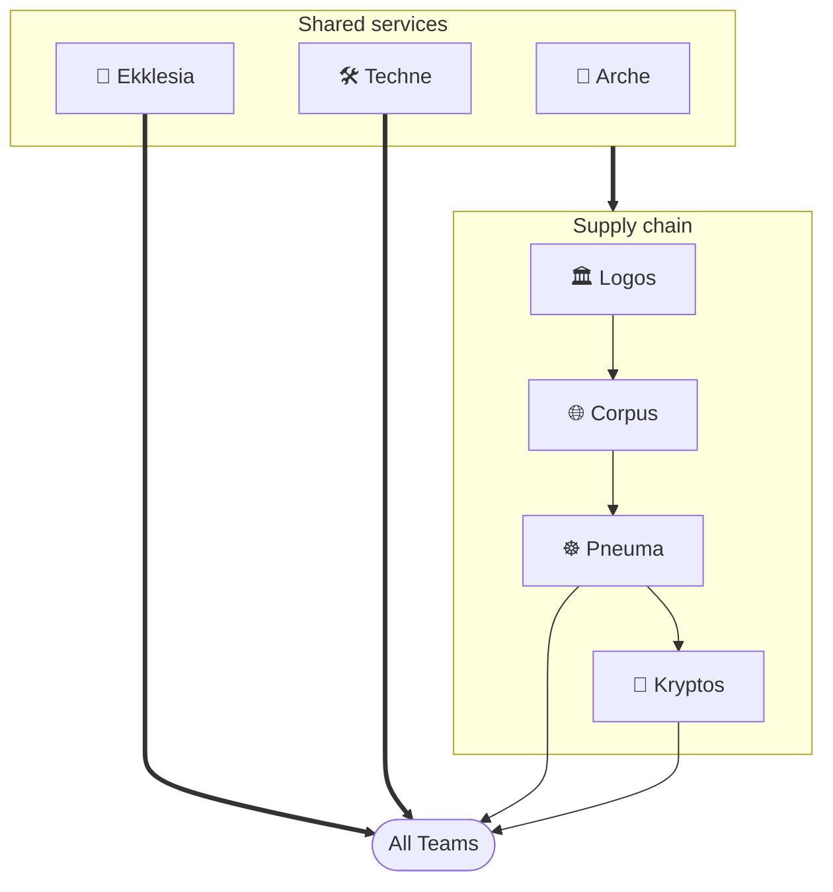

import Card from '@site/src/components/Card';
import CardGrid from '@site/src/components/CardGrid';
import DocCard from '@theme/DocCard';

# Platform Grouping

The **platform grouping** is the set of platform teams that together provide the internal platform. Consumers should start with the capability they need, not the repository that implements it.

<DocCard item={{ type: 'link', href: '/onboarding', label: 'Onboarding your team', description: 'Describe your team and optional platform needs; Nomos prepares the reviewed changes across the owning repositories.' }} />

## Service catalog

| Need | Owning team | What the consumer provides |
| --- | --- | --- |
| Team, repository, access, or organization setup | Logos | Team identity, maintainers, members, repositories, and requested features |
| GCP project, networking, DNS, registry, database, or CI identity | Corpus | Project requirements, APIs, connectivity, data-service, and access needs |
| Kubernetes namespace, ingress, authentication, certificates, policy, or telemetry | Pneuma | Workload identity, routes, auth requirements, image location, and observability needs |
| Reusable OpenTofu capability | Arche | A clear reusable infrastructure contract and consuming use case |
| Secrets service or OpenBao policy | Kryptos | Workload identity, environment, secret type, paths, and lease or rotation needs |
| Workflows, hooks, development environment, or agents | Techne | Repository workflow and developer-experience requirements |
| Platform documentation | Ekklesia | Audience, task, ownership, and verified implementation behavior |

## Teams

<CardGrid>
  <Card item={{ icon: '🏛️', title: 'Logos', note: 'Team structure, identity, repositories, and organization governance.', link: '/platform-grouping/logos', linkText: 'Learn more →' }} />
  <Card item={{ icon: '🌐', title: 'Corpus', note: 'GCP projects, networking, DNS, registries, state, and managed data foundations.', link: '/platform-grouping/corpus', linkText: 'Learn more →' }} />
  <Card item={{ icon: '☸️', title: 'Pneuma', note: 'Managed GKE runtime, service mesh, gateway authentication, certificates, policy, and telemetry.', link: '/platform-grouping/pneuma', linkText: 'Learn more →' }} />
  <Card item={{ icon: '🧱', title: 'Arche', note: 'Reusable OpenTofu modules used to implement consistent platform capabilities.', link: '/platform-grouping/arche', linkText: 'View modules →' }} />
  <Card item={{ icon: '📖', title: 'Ekklesia', note: 'Customer-facing platform documentation and contribution standards.', link: '/platform-grouping/ekklesia', linkText: 'Learn more →' }} />
  <Card item={{ icon: '🔐', title: 'Kryptos', note: 'OpenBao runtime, secrets policy, authentication, and secret-engine lifecycle.', link: '/platform-grouping/kryptos', linkText: 'Learn more →' }} />
  <Card item={{ icon: '🛠️', title: 'Techne', note: 'Reusable workflows, hooks, development environments, agents, and platform tooling.', link: '/platform-grouping/techne', linkText: 'Learn more →' }} />
</CardGrid>

## Team context

Each team owns a distinct context with explicit upstream/downstream relationships.

### Team dependencies

The deployment supply chain is Logos → Corpus → Pneuma → Kryptos. Kryptos depends on Pneuma for runtime but exposes secrets services back to all teams. Arche, Ekklesia, and Techne are shared capabilities used across the grouping.

```mermaid
flowchart TD
    AllTeams(["All Teams"])

    subgraph sk ["Shared services"]
        direction LR
        Arche["🧱 Arche"]
        Ekklesia["📖 Ekklesia"]
        Techne["🛠️ Techne"]
    end

    subgraph cs ["Supply chain"]
        direction LR
        Logos["🏛️ Logos"] --> Corpus["🌐 Corpus"]
        Corpus --> Pneuma["☸️ Pneuma"]
        Pneuma --> Kryptos["🔐 Kryptos"]
    end

    sk ==> cs
    Ekklesia ==> AllTeams
    Techne ==> AllTeams
    Pneuma --> AllTeams
    Kryptos --> AllTeams
```

## Team Topologies

### Interaction Modes

Team Topologies defines three interaction modes — **X-as-a-Service** (consume without collaboration), **Collaboration** (work together temporarily to solve a problem), and **Facilitating** (help another team improve capability). Collaboration is always time-boxed; the goal is to transition to X-as-a-Service once the consuming team is self-sufficient.

| Team | Steady-State Mode |
|---|---|
| Logos | <nobr>🔵 X-as-a-Service</nobr> |
| Corpus | <nobr>🔵 X-as-a-Service</nobr> |
| Pneuma | <nobr>🔵 X-as-a-Service</nobr> |
| Arche | <nobr>🔵 X-as-a-Service</nobr> |
| Ekklesia | <nobr>🟢 Facilitating</nobr> |
| Kryptos | <nobr>🔵 X-as-a-Service</nobr> |
| Techne | <nobr>🟢 Facilitating</nobr> |

_🔵 X-as-a-Service · 🟡 Collaboration · 🟢 Facilitating_

### Cognitive Load

Team Topologies distinguishes three types of cognitive load — **intrinsic** (inherent domain complexity), **extraneous** (friction from poor tooling), and **germane** (productive expertise-building). The platform is designed to eliminate extraneous load through shared automation (Arche, Techne), so each team's cognitive budget is spent entirely on intrinsic and germane load.

| Team | Working Domains | High Intrinsic Domains |
|---|---|---|
| Ekklesia | 🟢 1 / 4 | 🟢 0 / 3 |
| Techne | 🟡 3 / 4 | 🟢 0 / 3 |
| Arche | 🟢 3 / 4 | 🟢 1 / 3 |
| Kryptos | 🟢 2 / 4 | 🟡 2 / 3 |
| Logos | 🟠 4 / 4 | 🟢 0 / 3 |
| Corpus | 🟠 4 / 4 | 🟢 1 / 3 |
| Pneuma | 🔴 6 / 4 · [ADR →](/platform-grouping/pneuma#pneuma-cognitive-load-mitigation) | 🔴 4 / 3 |

_🟢 within limit · 🟡 approaching · 🟠 at limit · 🔴 over limit_

### Team Capacity

Internally, each platform engineer specializes in one team's context; externally the platform grouping presents a coherent interface to stream-aligned teams — consistent tooling, documentation, and services regardless of which team delivers them.

Headcount is derived from the cognitive load analysis. When operating within capacity, a team requires one platform engineer to maintain and evolve its scope. A team approaching or at its limit is a candidate for additional capacity or scope reduction. Any team flagged 🔴 over limit is the highest priority for intervention — either a second engineer, scope reduction, or tooling investment to lower extraneous load.

#### Platform Lead

A single **Platform Lead** spans all teams. This role does not belong to any one team — it exists above them. On this platform, the Platform Lead also serves as the **Product Manager**, owning both the technical direction and the platform roadmap.

Responsibilities:

- Owns the platform roadmap and prioritizes work based on stream-aligned team needs
- Interfaces with stream-aligned team leads and engineering leadership to inform that roadmap
- Owns cross-team dependency sequencing (Logos → Corpus → Pneuma)
- Ratifies Architecture Decision Records (ADRs) across all teams
- Unblocks cross-team decisions that no single platform engineer can resolve
- Allocates capacity across staffed teams based on platform demand

#### Platform Engineers

Each staffed team starts with one platform engineer who owns the team's context end-to-end. Teams can scale beyond one engineer as cognitive load demands — the cognitive load analysis is the guide for when to add capacity.

| Team | Min. Engineers | Role |
|---|---|---|
| Logos | 1 | Owns org structure, identity, GitHub, and Datadog team management |
| Corpus | 1 | Owns GCP projects, shared VPC, state buckets, and workload identity |
| Pneuma | 1 | Owns GKE clusters, service mesh, policy enforcement, and cluster add-ons — currently flagged 🔴 over limit, candidate for a second engineer |
| Kryptos | 1 | Owns secrets infrastructure, PKI, and cryptographic controls |
| Arche | — | Innersource — no dedicated engineer |
| Ekklesia | — | Innersource — no dedicated engineer |
| Techne | — | Innersource — no dedicated engineer |

**Total: 4–5 engineers + 1 Platform Lead** _(minimum staffing — scale per cognitive load analysis)_

#### Innersource Model

Arche, Ekklesia, and Techne operate without dedicated engineers. Instead, they run as **innersource** repositories — open for contribution from any engineer on the platform or from stream-aligned teams.

How it works:

- Any engineer may open a pull request to an innersource repo
- Platform engineers from staffed teams (Logos, Corpus, Pneuma, Kryptos) serve as code owners and reviewers
- The Platform Lead has final approval authority on structural or architectural changes
- Stream-aligned teams can unblock themselves by contributing fixes or enhancements directly, rather than filing tickets and waiting

This model distributes platform knowledge across the organization, reduces bottlenecks on the staffed teams, and ensures innersource repos evolve with the needs of their consumers rather than on a centralized backlog.
