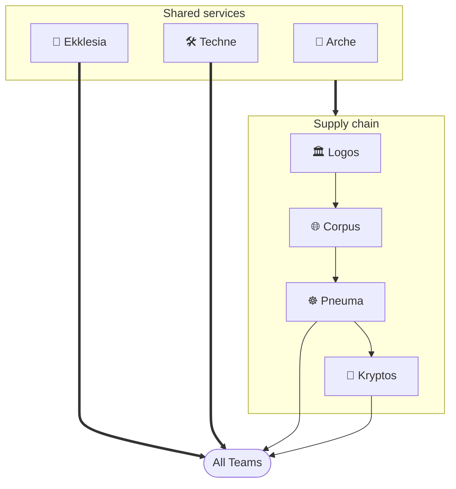

import Card from '@site/src/components/Card';
import CardGrid from '@site/src/components/CardGrid';

# Platform Grouping

The **platform grouping** is the set of platform teams that together provide the internal platform. Each team owns a distinct context; together they expose a single, coherent interface to the teams that use the platform: the [Nomos Agent](../getting-started/onboarding.mdx). This section documents how each team's capability is built and operated. Teams using the platform should start with [Getting Started](../getting-started/index.md) instead.

## Teams

<CardGrid>
  <Card item={{ icon: '🏛️', title: 'Logos', note: 'Team structure, identity, repositories, and organization governance.', link: '/platform-grouping/logos', linkText: 'Learn more →' }} />
  <Card item={{ icon: '🌐', title: 'Corpus', note: 'GCP projects, networking, DNS, registries, state, and managed data foundations.', link: '/platform-grouping/corpus', linkText: 'Learn more →' }} />
  <Card item={{ icon: '☸️', title: 'Pneuma', note: 'Managed GKE runtime, service mesh, gateway authentication, certificates, policy, and telemetry.', link: '/platform-grouping/pneuma', linkText: 'Learn more →' }} />
  <Card item={{ icon: '🧱', title: 'Arche', note: 'Reusable OpenTofu modules used to implement consistent platform capabilities.', link: '/platform-grouping/arche', linkText: 'View modules →' }} />
  <Card item={{ icon: '📖', title: 'Ekklesia', note: 'Customer-facing platform documentation and contribution standards.', link: '/platform-grouping/ekklesia', linkText: 'Learn more →' }} />
  <Card item={{ icon: '🔐', title: 'Kryptos', note: 'OpenBao runtime, secrets policy, authentication, and secret-engine lifecycle.', link: '/platform-grouping/kryptos', linkText: 'Learn more →' }} />
  <Card item={{ icon: '🛠️', title: 'Techne', note: 'Reusable workflows, hooks, development environments, agents, and platform tooling.', link: '/platform-grouping/techne', linkText: 'Learn more →' }} />
</CardGrid>

## Team context

Each team owns a distinct context with explicit upstream/downstream relationships.

### Team dependencies

The deployment supply chain is Logos → Corpus → Pneuma → Kryptos. Kryptos depends on Pneuma for runtime but exposes secrets services back to all teams. Arche, Ekklesia, and Techne are shared capabilities used across the grouping.

```mermaid
flowchart TD
    AllTeams(["All Teams"])

    subgraph sk ["Shared services"]
        direction LR
        Arche["🧱 Arche"]
        Ekklesia["📖 Ekklesia"]
        Techne["🛠️ Techne"]
    end

    subgraph cs ["Supply chain"]
        direction LR
        Logos["🏛️ Logos"] --> Corpus["🌐 Corpus"]
        Corpus --> Pneuma["☸️ Pneuma"]
        Pneuma --> Kryptos["🔐 Kryptos"]
    end

    sk ==> cs
    Ekklesia ==> AllTeams
    Techne ==> AllTeams
    Pneuma --> AllTeams
    Kryptos --> AllTeams
```

Interaction modes, cognitive load, staffing, and the innersource model are in the [Operating Model](./operating-model.md).
