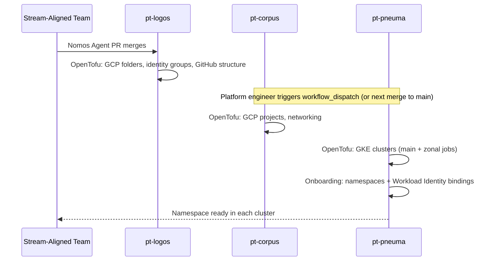

# Cluster Management

Pneuma provisions one GKE cluster per zone, consuming Corpus networking and Logos team data. Clusters are CIS-hardened, Fleet-enrolled, and configured for Workload Identity from the start.

- **GKE clusters**: Regional clusters (highly available control plane) with a single-zone node pool per cluster — one cluster per zone (e.g., `pt-pneuma-us-east1-b`). Zone-scoped node pools ensure Istio's locality-aware load balancing keeps traffic within a zone, eliminating cross-zone hot spots in the mesh. Clusters are CIS GKE Benchmark hardened and Fleet-enrolled for multi-cluster ingress.
- **Workload Identity**: Kubernetes service accounts are mapped to GCP service accounts, eliminating node-level credential access
- **Namespace onboarding**: A dedicated onboarding workspace in the Pneuma pipeline creates Kubernetes namespaces and Workload Identity bindings per team. It runs automatically within the same pipeline after the zonal cluster job completes — no separate trigger is needed once the pipeline starts. The Pneuma pipeline itself triggers on every merge to `pt-pneuma` main, or a platform engineer can trigger it immediately via `workflow_dispatch`.

## Namespace Provisioning

Namespace provisioning is **automated within the Pneuma pipeline** but is **not cross-triggered** by a Logos or Corpus merge. Each repo deploys independently when its own code merges to main, or when a platform engineer triggers `workflow_dispatch`.

Corpus and Pneuma are triggered independently — there is no automatic cascade from a Logos PR merge. A platform engineer must either merge a pending PR to each repo or manually trigger their `workflow_dispatch` workflow. Once Pneuma's pipeline runs, the onboarding workspace executes automatically as part of the pipeline; no additional action is required.

:::tip Architecture Decision Records

This page includes [Architecture Decision Records](#architecture-decision-records) documenting the key design decisions.

:::

## Components

| Component | Description |
|---|---|
| `gke-cluster` | A regional GKE cluster (regional control plane with zone-scoped node pools, e.g., `pt-pneuma-us-east1-b`) with KMS encryption, Workload Identity, and CIS hardening — regional control planes with zone-scoped node pools reduce Istio control plane hotspots |
| `node-pool` | A managed node pool with auto-provisioning, node auto-repair, and auto-upgrade |
| `fleet` | A GKE Fleet registration enabling multi-cluster service discovery and ingress across zones |
| `workload-identity` | Kubernetes-to-GCP service account mapping, allowing pods to authenticate to GCP without keys |

## Core Invariants

- etcd is KMS-encrypted at rest — `database_encryption` with `state = "ENCRYPTED"` is hardcoded in the GKE module.
- Workload Identity is enabled on every node pool — no static credentials for pod-level GCP access.
- Shielded nodes with Secure Boot and integrity monitoring are enforced on every node — no unverified boot path.
- Client certificate authentication is permanently disabled — `issue_client_certificate = false` is hardcoded.
- Dataplane V2 (eBPF) is hardcoded as the network datapath — no legacy kube-proxy on any cluster.

## Architecture Decision Records

### One Cluster Per Zone with Five Add-on Layers

<table>
  <thead>
    <tr><th>Status</th><th>Date</th><th>Deciders</th></tr>
  </thead>
  <tbody>
    <tr><td>Accepted ✅</td><td>April 2026</td><td>Pneuma</td></tr>
  </tbody>
</table>

#### Context and Problem Statement

Kubernetes workload environments require more than just a cluster — they need a service mesh, certificate management, admission policy enforcement, and observability before they are ready to receive application teams. These concerns are operationally distinct: they have different upgrade cycles, failure modes, and ownership boundaries. Running them as one undifferentiated deployment creates coordination problems and makes individual components hard to reason about or replace.

The platform also needs a clear scaling model for clusters. Sizing a single large cluster per environment requires predicting peak load. Cluster failure affects all tenants. Regional failure affects all zones at once.

#### Decision

1. **Regional clusters with zone-scoped node pools.** Each cluster has a regional control plane (highly available across three zones) but a single-zone node pool — one cluster per zone (e.g., `pt-pneuma-us-east1-b`, `pt-pneuma-us-east4-a`). Keeping node pools zone-local ensures Istio's locality-aware load balancing routes traffic within the zone by default, preventing cross-zone hot spots in the mesh. Clusters scale by adding zones, not by growing individual cluster size. Each cluster is independently managed, independently upgradeable, and independently recoverable.

2. **Five add-on layers for the cluster.** The workload runtime is decomposed into five areas of concern, each deployed and managed independently:

| Layer | Tool | Concern |
|---|---|---|
| [Cluster Management](./cluster-management.md) | GKE | Compute, networking attachment, Workload Identity, Fleet enrollment |
| [Service Mesh](./service-mesh.md) | Istio | mTLS, traffic management, ingress, Datadog AAP |
| [Certificate Management](./certificate-management.md) | cert-manager | Istio CA, mTLS PKI, and workload certificate signing via istio-csr |
| [Policy Enforcement](./policy-enforcement.md) | OPA Gatekeeper | Kubernetes admission control and audit |
| [Observability](./observability.md) | Datadog Operator | Metrics, logs, and traces from all workloads |

Each layer maps to a dedicated subdirectory workspace in `pt-pneuma`, deployed in the correct order via GitHub Actions `needs` dependencies.

#### Alternatives Considered

- **One large cluster per environment** — Rejected. Single point of failure per environment. Blast radius of a misconfiguration or upgrade failure is the entire environment. Cannot scale horizontally without redesign.
- **One cluster per team** — Rejected. Multiplies operational overhead without a commensurate benefit. The one-cluster-per-zone model provides tenant isolation via namespaces and OPA policies without per-team cluster sprawl.
- **Bundle all add-ons into a single deployment step** — Rejected. CRD ordering constraints (e.g., cert-manager CRDs must exist before Istio certificate resources) require a defined deployment order. Separate workspaces with explicit dependencies makes this order visible and enforceable.

#### Consequences

- Zone failure is contained — other clusters continue serving traffic
- Add-on upgrades (e.g., Istio minor version) are applied per cluster without touching cluster infrastructure
- Adding a new zone requires claiming a CIDR slot from the Corpus IPAM plan and adding a zonal workspace to `pt-pneuma`
- Each add-on layer has its own subdirectory, workspace, and deployment job in the workflow
