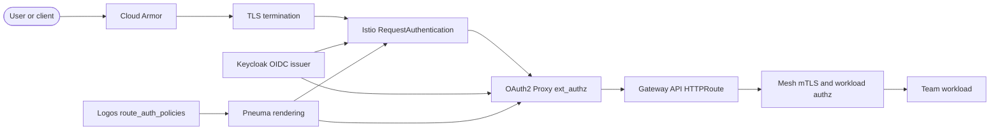

# Gateway Auth

Pneuma centralizes external application authentication and authorization at the shared gateway clusters. Stream-aligned teams declare route-level auth intent in Logos; Pneuma turns that contract into Istio and OAuth2 Proxy enforcement at the gateway before traffic reaches workload clusters.

:::tip Architecture Decision Records

This page includes [Architecture Decision Records](#architecture-decision-records) documenting the key design decisions.

:::

## Architecture

Gateway auth is a centralized authn/authz layer on the Pneuma gateway data plane (`gateway-istio`). It combines identity, session validation, JWT validation, and Istio external authorization without requiring app teams to run their own ingress auth stack.

## Components

| Component | Owner | Description |
|---|---|---|
| Keycloak | Pneuma via Arche | OIDC issuer and IAM layer deployed on gateway clusters by the `pt-pneuma` regional `keycloak` workspace. The `pt-arche-kubernetes-keycloak` module deploys the Helm release and persists state in Cloud SQL PostgreSQL. |
| OAuth2 Proxy | Pneuma via Arche | Browser session and bearer-token validator deployed by the `pt-pneuma` regional `oauth2-proxy` workspace through `pt-arche-kubernetes-oauth2-proxy`. It is registered in Istio `MeshConfig` as the `oauth2-proxy` ext_authz `ExtensionProvider`. |
| Istio `RequestAuthentication` | Pneuma | Validates JWTs against Keycloak JWKS at the gateway data plane before authorization decisions are evaluated. |
| Istio `AuthorizationPolicy` | Pneuma | Uses `action: CUSTOM` and provider `oauth2-proxy` for enforced routes, excluding standard health paths, OAuth2 callback paths, and declared public paths. Claim checks enforce required groups and roles. |
| Logos `route_auth_policies` | Logos | Source-of-truth team intent keyed by route name. App teams change this contract through Logos, usually with the Nomos self-serve flow. |

## Request Evaluation Order

Every external request follows this order at the gateway:

1. **Cloud Armor** evaluates WAF, rate limiting, and edge protection policy before the request reaches the gateway backend.
2. **TLS terminates at the gateway** using the shared wildcard certificate and Gateway API listener.
3. **Istio `RequestAuthentication` validates JWTs** against the Keycloak JWKS on the `gateway-istio` data plane.
4. **OAuth2 Proxy evaluates ext_authz** for enforced paths, validating browser session cookies or bearer tokens and denying requests that do not satisfy the route policy.
5. **Gateway API `HTTPRoute` routing** selects the team backend service from Logos-declared route intent.
6. **Mesh-level mTLS and authorization** protect service-to-service traffic in the workload clusters after the request enters the mesh.

:::warning Fail-closed by default

Enforced auth policies do not fail open. If OAuth2 Proxy or the ext_authz path is unavailable, the gateway denies the request rather than bypassing authorization.

:::

## Team Consumption Model

Teams do not apply Kubernetes auth resources to Pneuma clusters. They declare intent in Logos alongside their route declarations using `route_auth_policies`, a map keyed by an existing route name. Pneuma consumes the resolved Logos outputs through `module.core_helpers` and renders the gateway resources centrally.

Each policy supports:

- `enforced` — Optional boolean. Defaults to `true`; set to `false` only for explicitly public routes.
- `public_paths` — Optional list of path prefixes that bypass enforcement. Each path must sit under the referenced route path and cannot be `/`.
- `required_groups` — Optional list of Keycloak group claims accepted for the route.
- `required_roles` — Optional list of Keycloak realm roles accepted for the route.

Enforced policies require at least one group or role. Use the [Nomos Agent](/onboarding) to author or update the Logos spec; Nomos validates the request against the `pt-techne-mcp-server` schema before opening the change.

## Ownership Boundaries

| Boundary | Responsibility |
|---|---|
| App teams | Declare route and auth intent in Logos only. They own application behavior behind the route, but not gateway authn/authz Kubernetes resources. |
| Logos | Contract and source of truth for teams, namespaces, routes, and `route_auth_policies`. |
| Pneuma | Central enforcement owner. It renders Keycloak, OAuth2 Proxy, Istio `RequestAuthentication`, Istio `AuthorizationPolicy`, Gateway API routes, RBAC, and admission guardrails. |
| Arche | Reusable provider modules for Keycloak and OAuth2 Proxy Helm-based deployments. |
| Techne | Schema tooling and Nomos self-serve agent flow that validate team-auth intent before Logos changes land. |
| Team repositories | Application code, services, and deployment manifests that receive already-authenticated gateway traffic. |

RBAC and admission guardrails in Pneuma prevent app teams from managing gateway authn/authz resources directly. This keeps all external auth behavior reviewable through Logos and centrally enforceable by Pneuma.

## Operational Expectations

- Unauthenticated requests are rejected at the gateway before routing to a team backend.
- OAuth2 Proxy validates both browser session cookies and bearer tokens, so browser and API clients use the same centralized policy path.
- Standard health paths, OAuth2 callback paths, and declared `public_paths` bypass ext_authz; all other enforced paths require a valid identity and matching group or role claim.
- Keycloak availability and Cloud SQL PostgreSQL persistence are gateway platform concerns owned by Pneuma.
- Route-auth changes deploy on the next Logos-to-Pneuma pipeline run, the same as route changes.

## Observability

Auth decision logs, ext_authz denials, and gateway access logs are collected in Datadog. Pneuma owns monitors and dashboards for auth failure rate, denial spikes, OAuth2 Proxy health, and Keycloak availability. Teams should use those Datadog surfaces when troubleshooting access denials before escalating to Pneuma.

## Core Invariants

- Auth intent is declared in Logos, not as team-managed Kubernetes resources in Pneuma.
- Enforced policies fail closed and require at least one allowed group or role.
- Public bypasses must be scoped below the route path and cannot make an entire host public by using `/`.
- JWT validation happens at the gateway data plane against Keycloak JWKS before ext_authz policy decisions.
- Browser cookies and bearer tokens follow the same gateway authorization path.

## Architecture Decision Records

### Centralized Gateway Auth Enforcement

<table>
  <thead>
    <tr><th>Status</th><th>Date</th><th>Deciders</th></tr>
  </thead>
  <tbody>
    <tr><td>Accepted ✅</td><td>July 2026</td><td>Pneuma, Logos, Techne</td></tr>
  </tbody>
</table>

#### Context and Problem Statement

External team services need consistent authentication and authorization without every team operating its own ingress auth stack. If each team owned Keycloak clients, OAuth2 Proxy instances, Istio auth policies, and gateway resources directly, the platform would drift into inconsistent fail-open behavior and unclear ownership during incidents.

#### Decision

Centralize authn/authz at Pneuma gateway clusters. Logos remains the contract where teams declare route-auth intent; Pneuma consumes that contract and renders Keycloak, OAuth2 Proxy ext_authz, Istio JWT validation, and Istio authorization policy centrally. Arche packages reusable Helm-based modules, and Techne provides the schema and Nomos authoring flow.

#### Alternatives Considered

- **Team-managed gateway auth resources** — Rejected. Direct Kubernetes ownership would bypass the reviewed Logos contract and make route isolation, fail-closed behavior, and incident ownership inconsistent.
- **Per-application OAuth2 Proxy sidecars** — Rejected. Duplicates auth infrastructure in every app, complicates upgrades, and does not protect requests before they enter workload clusters.
- **Application-only authorization** — Rejected. Leaves unauthenticated traffic to reach teams and makes centralized denial observability impossible.

#### Consequences

- Teams get a self-service auth contract without owning gateway internals.
- Pneuma is the single operational owner for gateway auth availability, denial behavior, and observability.
- Schema validation in Techne and PR review in Logos become part of the security boundary.
- Gateway auth outages deny enforced traffic instead of failing open.
