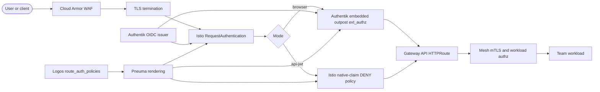

# Gateway Auth

Pneuma centralizes external application authentication and authorization at the shared gateway clusters. Stream-aligned teams declare route-level auth intent in Logos; Pneuma turns that contract into Istio and Authentik enforcement at the gateway before traffic reaches workload clusters.

:::tip Architecture Decision Records

This page includes [Architecture Decision Records](#architecture-decision-records) documenting the key design decisions.

:::

## Architecture

Gateway auth is a centralized authn/authz layer on the Pneuma gateway data plane (`gateway-istio`). It combines a platform-wide identity provider, JWT validation, forward-auth session validation, and Istio external authorization without requiring app teams to run their own ingress auth stack.

Authentik is the single platform-wide identity provider, published at `authentik.<env>.osinfra.io` (production drops the environment segment). It is deployed on the gateway clusters by the `pt-pneuma` regional `authentik` and `authentik-config` workspaces through the `pt-arche-kubernetes-authentik` module, with its state persisted in a Cloud SQL PostgreSQL instance. Authentik's **embedded outpost** provides the Envoy `ext_authz` endpoint used for browser sessions.

## Components

| Component | Owner | Description |
|---|---|---|
| Authentik | Pneuma via Arche | Platform-wide OIDC issuer and IAM layer deployed on gateway clusters by the `pt-pneuma` regional `authentik` workspace. The `pt-arche-kubernetes-authentik` module deploys the Helm release and persists state in Cloud SQL PostgreSQL. |
| Authentik embedded outpost | Pneuma via Arche | Forward-auth (`ext_authz`) endpoint for browser sessions, configured by the regional `authentik-config` workspace. It is registered in Istio `MeshConfig` as the `authentik` ext_authz `ExtensionProvider`. |
| Istio `RequestAuthentication` | Pneuma | `gateway-authentik-jwt` validates JWTs against the Authentik issuer and JWKS at the gateway data plane before authorization decisions are evaluated. |
| Istio `AuthorizationPolicy` | Pneuma | `browser` routes get an `action: CUSTOM` policy that forwards to the Authentik embedded outpost. `api-jwt` routes get a native-claim `action: DENY` policy that rejects requests lacking a validated principal or a matching `audiences`, `groups`, or `roles` claim. Standard health paths, Authentik callback paths, and declared public paths are excluded. |
| Logos `route_auth_policies` | Logos | Source-of-truth team intent keyed by route name. App teams change this contract through Logos, usually with the Nomos self-serve flow. |

## Request Evaluation Order

Every external request follows this order at the gateway:

1. **Cloud Armor** evaluates WAF, rate limiting, and edge protection policy before the request reaches the gateway backend.
2. **TLS terminates at the gateway** using the shared wildcard certificate and Gateway API listener.
3. **Istio `RequestAuthentication` validates JWTs** against the Authentik JWKS on the `gateway-istio` data plane. Requests carrying a token get a validated request principal; requests without one are unauthenticated.
4. **Authorization is enforced by mode** — `browser` routes forward to the Authentik embedded outpost via `ext_authz`; `api-jwt` routes are evaluated by a native-claim DENY policy. Health, Authentik callback, and declared public paths are exempt.
5. **Gateway API `HTTPRoute` routing** selects the team backend service from Logos-declared route intent.
6. **Mesh-level mTLS and authorization** protect service-to-service traffic in the workload clusters after the request enters the mesh.

:::warning Fail-closed by default

Enforced auth policies do not fail open. An unknown mode or a missing enforcement path is rejected before apply, and if the ext_authz path is unavailable the gateway denies the request rather than bypassing authorization.

:::

## Auth Modes

Each `route_auth_policies` entry selects one of three modes (default `browser`):

| Mode | Purpose | Required fields | Forbidden fields |
|---|---|---|---|
| `public` | No authentication — the route is open | none | `audiences`, `public_paths`, `required_groups`, `required_roles` |
| `browser` | Interactive Authentik SSO for human users | at least one of `required_groups` / `required_roles` | `audiences` |
| `api-jwt` | Machine-to-machine bearer JWT validation | at least one `audiences` value | none |

- **`browser`** renders a CUSTOM `AuthorizationPolicy` that forwards the request to the Authentik embedded outpost, which authenticates the interactive session. Group and role authorization for `browser` routes is delegated to Authentik application-policy bindings, so a `browser` route is authenticated-only until those bindings exist.
- **`api-jwt`** renders a `RequestAuthentication` plus a native-claim DENY `AuthorizationPolicy` that rejects any request without a validated JWT and any whose `audiences`, `required_groups`, or `required_roles` claims do not match.
- **`public`** renders no enforcement.

Claim matching is **OR within a single list** (any one listed value matches) and **AND across lists** (each declared list must be satisfied). Authentik emits flat `groups` and `roles` claims.

## Team Consumption Model

Teams do not apply Kubernetes auth resources to Pneuma clusters. They declare intent in Logos alongside their route declarations using `route_auth_policies`, a map keyed by an existing route name. Pneuma consumes the resolved Logos outputs through `module.core_helpers` and renders the gateway resources centrally.

Each policy supports:

- `mode` — Optional. One of `public`, `browser`, or `api-jwt`. Defaults to `browser`.
- `audiences` — Required for `api-jwt`, forbidden otherwise. JWT audiences accepted for the route.
- `public_paths` — Optional list of unauthenticated paths under the referenced route path. Each path must start with `/`, cannot be `/`, and is matched as declared (add a trailing `/*` to exempt a subtree). Not allowed on `public`.
- `required_groups` — Optional list of Authentik group claims accepted for the route.
- `required_roles` — Optional list of Authentik role claims accepted for the route.

A `browser` policy must include at least one required group or role; an `api-jwt` policy must include at least one audience. Use the [Nomos Agent](/onboarding) to author or update the Logos spec; Nomos validates the request against the `pt-techne-mcp-server` schema before opening the change.

## Ownership Boundaries

| Boundary | Responsibility |
|---|---|
| App teams | Declare route and auth intent in Logos only. They own application behavior behind the route, but not gateway authn/authz Kubernetes resources. |
| Logos | Contract and source of truth for teams, namespaces, routes, and `route_auth_policies`. |
| Pneuma | Central enforcement owner. It renders Authentik, the embedded outpost, Istio `RequestAuthentication`, Istio `AuthorizationPolicy`, Gateway API routes, RBAC, and admission guardrails. |
| Arche | Reusable provider module (`pt-arche-kubernetes-authentik`) for the Authentik Helm-based deployment and configuration. |
| Techne | Schema tooling and Nomos self-serve agent flow that validate team-auth intent before Logos changes land. |
| Team repositories | Application code, services, and deployment manifests that receive already-authenticated gateway traffic. |

RBAC and admission guardrails in Pneuma prevent app teams from managing gateway authn/authz resources directly. This keeps all external auth behavior reviewable through Logos and centrally enforceable by Pneuma.

## Operational Expectations

- Unauthenticated requests to enforced routes are rejected at the gateway before routing to a team backend.
- Browser sessions are validated by the Authentik embedded outpost; API clients present bearer JWTs validated by Istio `RequestAuthentication` and the native-claim DENY policy.
- Standard health paths, Authentik callback paths (`/outpost.goauthentik.io`), and declared `public_paths` bypass enforcement; all other enforced paths require a valid identity and, for `api-jwt`, matching claims.
- Authentik availability and Cloud SQL PostgreSQL persistence are gateway platform concerns owned by Pneuma.
- Route-auth changes deploy on the next Logos-to-Pneuma pipeline run, the same as route changes.

## Observability

Auth decision logs, ext_authz denials, and gateway access logs are collected in Datadog. Pneuma owns monitors and dashboards for auth failure rate, denial spikes, embedded-outpost health, and Authentik availability. Teams should use those Datadog surfaces when troubleshooting access denials before escalating to Pneuma. See [Observability](./observability.md#gateway-auth-observability) for details.

## Core Invariants

- Auth intent is declared in Logos, not as team-managed Kubernetes resources in Pneuma.
- Enforced modes fail closed; an unknown mode is rejected before apply.
- `browser` requires at least one allowed group or role; `api-jwt` requires at least one audience.
- Public bypasses must be scoped below the route path and cannot make an entire host public by using `/`.
- JWT validation happens at the gateway data plane against the Authentik JWKS before authorization decisions.

## Architecture Decision Records

### Centralized Gateway Auth Enforcement

<table>
  <thead>
    <tr><th>Status</th><th>Date</th><th>Deciders</th></tr>
  </thead>
  <tbody>
    <tr><td>Accepted ✅</td><td>July 2026</td><td>Pneuma, Logos, Techne</td></tr>
  </tbody>
</table>

#### Context and Problem Statement

External team services need consistent authentication and authorization without every team operating its own ingress auth stack. If each team owned identity clients, forward-auth instances, Istio auth policies, and gateway resources directly, the platform would drift into inconsistent fail-open behavior and unclear ownership during incidents.

#### Decision

Centralize authn/authz at Pneuma gateway clusters. Logos remains the contract where teams declare route-auth intent; Pneuma consumes that contract and renders Authentik, the embedded-outpost ext_authz path, Istio JWT validation, and Istio authorization policy centrally. Arche packages the reusable Authentik module, and Techne provides the schema and Nomos authoring flow.

#### Alternatives Considered

- **Team-managed gateway auth resources** — Rejected. Direct Kubernetes ownership would bypass the reviewed Logos contract and make route isolation, fail-closed behavior, and incident ownership inconsistent.
- **Per-application forward-auth sidecars** — Rejected. Duplicates auth infrastructure in every app, complicates upgrades, and does not protect requests before they enter workload clusters.
- **Application-only authorization** — Rejected. Leaves unauthenticated traffic to reach teams and makes centralized denial observability impossible.

#### Consequences

- Teams get a self-service auth contract without owning gateway internals.
- Pneuma is the single operational owner for gateway auth availability, denial behavior, and observability.
- Schema validation in Techne and PR review in Logos become part of the security boundary.
- Gateway auth outages deny enforced traffic instead of failing open.
