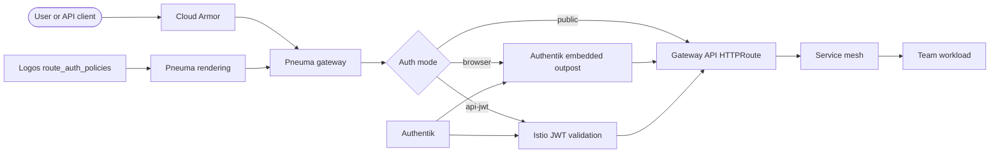

# Gateway Authentication

Pneuma enforces authentication and authorization for external application routes at the shared gateway. Teams declare route-level intent in Logos; Pneuma renders the required Istio and Authentik resources before traffic reaches a workload cluster.

:::tip Architecture Decision Records

This page includes [Architecture Decision Records](#architecture-decision-records) documenting the key design decisions.

:::

## Architecture

Gateway auth runs on the Pneuma gateway data plane (`gateway-istio`). It combines Authentik, Istio JWT validation, and Envoy external authorization so application teams do not need to operate an ingress authentication stack.

Authentik is the platform identity provider. It is available at `authentik.<env>.osinfra.io`; production omits the environment segment. The `pt-pneuma` `authentik` and `authentik-config` workspaces deploy and configure it through `pt-arche-kubernetes-authentik`. Authentik stores persistent data in Cloud SQL PostgreSQL, and its embedded outpost provides the Envoy `ext_authz` endpoint for browser sessions.



## Components

| Component | Owner | Description |
|---|---|---|
| Logos `route_auth_policies` | Logos | Source of truth for route-level auth intent. Policies are keyed by an existing route name. |
| Authentik | Pneuma via Arche | Platform OIDC provider and identity layer deployed on the gateway clusters. |
| Embedded outpost | Pneuma via Arche | Forward-auth endpoint for browser sessions. Istio registers it as the `authentik` external authorization provider. |
| Authentik applications and policies | Pneuma via Arche | Per-host application, proxy provider, and policy bindings generated from browser-route group and role requirements. |
| Istio `RequestAuthentication` | Pneuma | Validates bearer JWTs against the Authentik issuer and JWKS. |
| Istio `AuthorizationPolicy` | Pneuma | Sends browser requests to Authentik or enforces API JWT claims natively. |

## Request Flow

1. Cloud Armor evaluates edge security policy.
2. TLS terminates at the shared gateway.
3. Istio validates a presented JWT against the Authentik JWKS.
4. The route's auth mode determines enforcement:
   - `browser` sends the request to the Authentik embedded outpost.
   - `api-jwt` evaluates the validated JWT principal and claims.
   - `public` skips auth enforcement.
5. Gateway API routes Authentik callbacks to the embedded outpost and application traffic to the team service.
6. Mesh mTLS and workload authorization protect traffic after it enters the service mesh.

:::warning Fail-closed by default

Enforced routes do not fail open. Configuration with an unknown or incomplete auth mode is rejected before deployment. If the browser authorization service is unavailable, the gateway denies the request.

:::

## Auth Modes

Each `route_auth_policies` entry selects one of three modes. The default is `browser`.

| Mode | Purpose | Required fields | Forbidden fields |
|---|---|---|---|
| `public` | No authentication — the route is open | none | `audiences`, `public_paths`, `required_groups`, `required_roles` |
| `browser` | Interactive Authentik SSO for human users | at least one of `required_groups` / `required_roles` | `audiences` |
| `api-jwt` | Machine-to-machine bearer JWT validation | at least one `audiences` value | none |

For claim lists, matching is **OR within a list** and **AND across lists**. For example, a route with two audiences and one required role accepts either audience, but the role must also match.

For browser routes, Pneuma represents both `required_groups` and `required_roles` as Authentik group-backed policy bindings. API JWT routes evaluate the corresponding `groups` and `roles` token claims directly.

## Declaring a Policy

Teams declare auth intent in Logos beside the corresponding route. `route_auth_policies` is keyed by route name and is valid only in a mesh-enabled namespace.

```hcl
namespaces = {
  "api" = {
    istio_injection = "enabled"

    route_auth_policies = {
      "api" = {
        mode            = "browser"
        public_paths    = ["/api/healthz"]
        required_groups = ["platform-engineers"]
      }
    }

    routes = {
      "api" = {
        path    = "/api"
        port    = 8080
        service = "api-service"
      }
    }
  }
}
```

| Field | Description |
|---|---|
| `mode` | Optional. `public`, `browser`, or `api-jwt`; defaults to `browser`. |
| `audiences` | JWT audiences accepted by an `api-jwt` route. Required for `api-jwt` and forbidden for other modes. |
| `public_paths` | Unauthenticated paths beneath an enforced route. Entries must start with `/` and cannot be `/`, `/*`, or `*`. Add `/*` to exempt a subtree. |
| `required_groups` | Authentik groups accepted by the route. |
| `required_roles` | Authentik application roles accepted by the route. |

Use the [Nomos Agent](/onboarding) to create or update the Logos declaration. Nomos validates the policy before opening the change.

### Browser Auth Limitations

:::caution Group membership is not synchronized

Pneuma creates the Authentik applications, providers, groups, and policy bindings required for browser enforcement. User membership is not yet synchronized from Google Identity or Logos. Users must be assigned to the required Authentik group. This gap is tracked in [pt-pneuma#181](https://github.com/osinfra-io/pt-pneuma/issues/181).

:::

:::caution Policies are scoped per host

Browser applications and policy bindings are scoped to a host, not an individual path. If two browser routes on the same host declare different requirements, Authentik's `Any` policy-engine mode allows a user who satisfies either policy to access both routes. This gap is tracked in [pt-pneuma#183](https://github.com/osinfra-io/pt-pneuma/issues/183).

:::

## Verification

The platform `istio-test` route is the deployed browser-auth check:

| Request | Expected result |
|---|---|
| `/istio-test` without an Authentik session | Redirect to Authentik |
| `/istio-test` after signing in as a member of `all` | Application response |
| `/istio-test/metadata/cluster-name` without a session | `200 OK` |

The route uses `mode = "browser"` and `required_groups = ["all"]`. The cluster-name endpoint is explicitly included in `public_paths` because Datadog synthetics and the endpoint-check workflow use it for anonymous infrastructure health checks.

OAuth callback requests under `/outpost.goauthentik.io` are routed directly to the embedded outpost on every protected browser host. This routing is required for the browser flow to return to the original application.

## Ownership Boundaries

| Boundary | Responsibility |
|---|---|
| Application teams | Declare routes and auth intent in Logos; own application behavior behind the gateway. |
| Logos | Stores the team, namespace, route, and `route_auth_policies` contract. |
| Pneuma | Renders and operates gateway routing, Authentik, Istio auth policy, RBAC, and admission guardrails. |
| Arche | Provides the reusable `pt-arche-kubernetes-authentik` deployment and configuration module. |
| Techne | Provides schema tooling and the Nomos self-service workflow. |

## Operational Expectations

- Unauthenticated requests to enforced application paths are denied before reaching a team backend.
- Standard health paths, Authentik callbacks, and declared `public_paths` bypass enforcement.
- Route-auth changes deploy through the normal Logos-to-Pneuma pipeline.
- Pneuma owns Authentik availability, Cloud SQL persistence, and gateway auth observability.
- Browser authorization depends on current Authentik group and role membership.

## Core Invariants

- Auth intent is declared in Logos, not in team-managed gateway resources.
- Enforced routes fail closed.
- `browser` requires at least one group or role; `api-jwt` requires at least one audience.
- Public bypasses cannot expose an entire route using `/`, `/*`, or `*`.
- JWT validation occurs at the gateway before authorization.

## Architecture Decision Records

### Centralized Gateway Authentication Enforcement

<table>
  <thead>
    <tr><th>Status</th><th>Date</th><th>Deciders</th></tr>
  </thead>
  <tbody>
    <tr><td>Accepted ✅</td><td>July 2026</td><td>Pneuma, Logos, Techne</td></tr>
  </tbody>
</table>

#### Context and Problem Statement

External team services need consistent authentication and authorization without every team operating its own ingress auth stack. If each team owned identity clients, forward-auth instances, Istio auth policies, and gateway resources directly, the platform would drift into inconsistent fail-open behavior and unclear ownership during incidents.

#### Decision

Centralize authn/authz at Pneuma gateway clusters. Logos remains the contract where teams declare route-auth intent; Pneuma consumes that contract and renders Authentik, the embedded-outpost ext_authz path, Istio JWT validation, and Istio authorization policy centrally. Arche packages the reusable Authentik module, and Techne provides the schema and Nomos authoring flow.

#### Alternatives Considered

- **Team-managed gateway auth resources** — Rejected. Direct Kubernetes ownership would bypass the reviewed Logos contract and make route isolation, fail-closed behavior, and incident ownership inconsistent.
- **Per-application forward-auth sidecars** — Rejected. Duplicates auth infrastructure in every app, complicates upgrades, and does not protect requests before they enter workload clusters.
- **Application-only authorization** — Rejected. Leaves unauthenticated traffic to reach teams and makes centralized denial observability impossible.

#### Consequences

- Teams get a self-service auth contract without owning gateway internals.
- Pneuma is the single operational owner for gateway auth availability, denial behavior, and observability.
- Schema validation in Techne and PR review in Logos become part of the security boundary.
- Gateway auth outages deny enforced traffic instead of failing open.

### Per-Host Browser Group and Role Enforcement

<table>
  <thead>
    <tr><th>Status</th><th>Date</th><th>Deciders</th></tr>
  </thead>
  <tbody>
    <tr><td>Accepted ✅</td><td>September 2026</td><td>Pneuma, Arche</td></tr>
  </tbody>
</table>

#### Context and Problem Statement

`browser`-mode routes validated only that a user had an authenticated Authentik session — the declared `required_groups` and `required_roles` on a route's `route_auth_policies` had no enforcement path. Any authenticated user could reach a `browser` route regardless of group or role membership, because no Authentik application, provider, or policy binding existed to evaluate those claims for a specific host.

#### Decision

Pneuma's `authentik-config` workspace now renders, per gateway host, an Authentik application and proxy provider plus one policy binding per declared group or role, sourced directly from each route's Logos `route_auth_policies`. The embedded outpost's `protocol_providers` list is updated to include every rendered browser provider so forward-auth actually evaluates the binding. This closes the enforcement gap without requiring any manual Authentik configuration per route.

The one remaining manual step — provisioning **Authentik group membership** itself from Logos/Google Identity groups — is out of scope for this decision and is tracked separately as [pt-pneuma#181](https://github.com/osinfra-io/pt-pneuma/issues/181).

#### Alternatives Considered

- **Manual per-route Authentik configuration** — Rejected. Requires an operator to hand-configure an application, provider, and policy binding in the Authentik UI for every enforced route, which does not scale, is not reviewable through Logos, and is easy to forget or get wrong.
- **A single shared Authentik application for all browser routes** — Rejected. Cannot express per-route group/role differences; any policy binding would apply uniformly across every host behind the embedded outpost.
- **Enforcing groups/roles entirely in Istio via JWT claims** — Rejected. Authentik's browser flow issues a session, not a JWT with claims usable by Istio's native `AuthorizationPolicy`; enforcement has to happen at the Authentik layer for interactive sessions.

#### Consequences

- `browser` routes with `required_groups` / `required_roles` are now actually enforced, closing the gap between declared Logos intent and rendered behavior.
- Adding or changing group/role requirements on a route is a Logos-only change; Pneuma re-renders the Authentik resources automatically.
- Authentik group membership sync remains an open gap ([pt-pneuma#181](https://github.com/osinfra-io/pt-pneuma/issues/181)) — enforcement is only as strong as the manual group assignments behind it until that is resolved.
