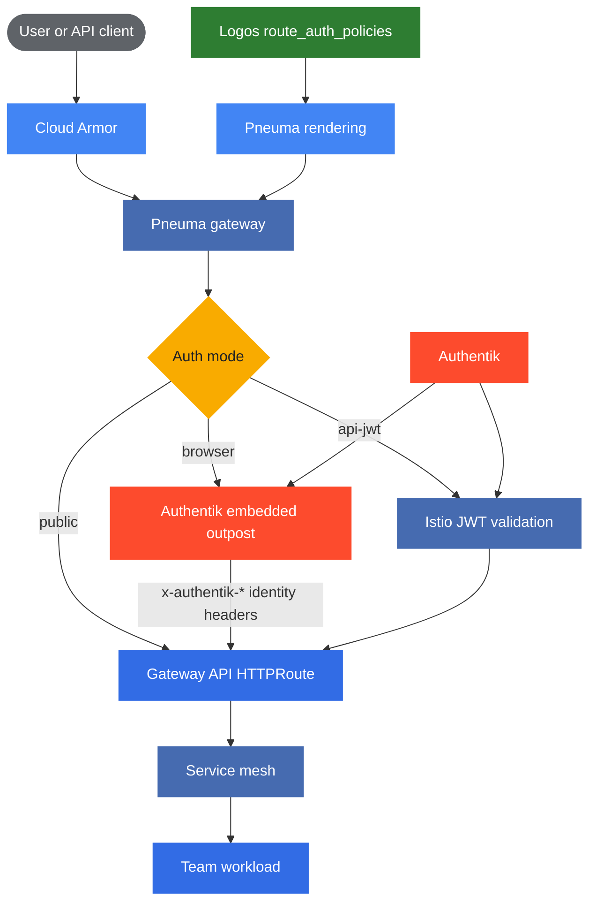

# Gateway Authentication

Pneuma enforces authentication and authorization for external application routes at the shared gateway. Teams request route-level intent through the Nomos Agent, which records it in Logos; Pneuma renders the required Istio and Authentik resources before traffic reaches a workload cluster.

:::info Consuming teams

This page is for Pneuma owners. To request a route and its authentication policy, see [Expose and Protect a Route](../../getting-started/expose-a-route.md).

:::

:::tip Architecture Decision Records

This page includes [Architecture Decision Records](#architecture-decision-records) documenting the key design decisions.

:::

## Architecture

Gateway auth runs on the Pneuma gateway data plane (`gateway-istio`). It combines Authentik browser-session enforcement, Istio JWT validation for API clients, and Envoy external authorization so application teams do not need to operate an ingress authentication stack.

Authentik is the platform identity provider. It is available at `authentik.<env>.osinfra.io`; production omits the environment segment. The `pt-pneuma` `authentik` and `authentik-config` workspaces deploy and configure it through `pt-arche-kubernetes-authentik`. Authentik stores persistent data in Cloud SQL PostgreSQL, and its embedded outpost provides the Envoy `ext_authz` endpoint for browser sessions.

Browser identity reaches workloads as gateway-controlled `x-authentik-*` headers, not a bearer JWT. The gateway owns that namespace, so a value supplied by an external client is never a trusted identity source.

```mermaid
flowchart TD
    classDef client fill:#5F6368,stroke:#5F6368,color:#fff
    classDef gcp fill:#4285F4,stroke:#4285F4,color:#fff
    classDef istio fill:#466BB0,stroke:#466BB0,color:#fff
    classDef authentik fill:#FD4B2D,stroke:#FD4B2D,color:#fff
    classDef kubernetes fill:#326CE5,stroke:#326CE5,color:#fff
    classDef logos fill:#2E7D32,stroke:#2E7D32,color:#fff
    classDef decision fill:#F9AB00,stroke:#F9AB00,color:#202124

    Client([User or API client]):::client --> Armor[Cloud Armor]:::gcp
    Armor --> Gateway[Pneuma gateway]:::istio
    Gateway --> Mode{Auth mode}
    Mode:::decision -->|browser| Outpost[Authentik embedded outpost]:::authentik
    Mode -->|api-jwt| JWT[Istio JWT validation]:::istio
    Mode -->|public| Route[Gateway API HTTPRoute]:::kubernetes
    Outpost -->|x-authentik-* identity headers| Route
    JWT --> Route
    Route --> Mesh[Service mesh]:::istio
    Mesh --> Workload[Team workload]:::kubernetes

    Logos[Logos route_auth_policies]:::logos --> Pneuma[Pneuma rendering]:::gcp
    Pneuma --> Gateway
    Authentik[Authentik]:::authentik --> Outpost
    Authentik --> JWT
```

## Components

| Component | Owner | Description |
|---|---|---|
| Logos `route_auth_policies` | Logos | Source of truth for route-level auth intent. Policies are keyed by an existing route name. |
| Authentik | Pneuma via Arche | Platform OIDC provider and identity layer deployed on the gateway clusters. |
| Embedded outpost | Pneuma via Arche | Forward-auth endpoint for browser sessions. Istio registers it as the `authentik` external authorization provider. |
| Authentik applications and policies | Pneuma via Arche | Per-host application, proxy provider, and policy bindings generated from browser-route group and role requirements. |
| Istio `RequestAuthentication` | Pneuma | Validates bearer JWTs against the Authentik issuer and JWKS. |
| Istio `AuthorizationPolicy` | Pneuma | Sends browser requests to Authentik or enforces API JWT claims natively. |

## Request Flow

1. Cloud Armor evaluates edge security policy. Authentik's `/api/v3/` paths on its exact environment hostname permit `DELETE`, `PATCH`, and `PUT` through the method-enforcement check so browser administration works. Other WAF checks remain active, and Authentik still enforces authentication, permissions, and CSRF protection. Gateway identity-header stripping preserves the exact `X-authentik-CSRF` header needed for browser writes; other client-supplied `X-authentik-*` headers are removed before forward authentication.
2. TLS terminates at the shared gateway.
3. The route's auth mode determines enforcement:
   - `browser` sends the request to the Authentik embedded outpost, which validates the browser session and returns trusted `x-authentik-*` identity headers for the upstream request.
   - `api-jwt` has Istio validate the bearer JWT against the Authentik JWKS, then evaluates the validated principal and claims.
   - `public` skips auth enforcement.
4. Gateway API routes Authentik callbacks to the embedded outpost and application traffic to the team service.
5. Mesh mTLS and workload authorization protect traffic after it enters the service mesh.

:::warning Fail-closed by default

Enforced routes do not fail open. Configuration with an unknown or incomplete auth mode is rejected before deployment. If the browser authorization service is unavailable, the gateway denies the request.

:::

## Browser Authorization

Pneuma renders one Authentik application and proxy provider per gateway host, with policy bindings for the declared `required_groups` and `required_roles`. API JWT routes evaluate the `groups` and `roles` token claims directly in Istio. Consumer-facing rules are in [Expose and Protect a Route](../../getting-started/expose-a-route.md#browser-routes).

:::caution Policies are scoped per host

Authentik applications and bindings are scoped to a host, not a path. Two browser routes on one host with different requirements would let a user satisfying either policy reach both, because Authentik uses its `Any` policy-engine mode. Logos rejects conflicting requirements until request-level isolation and existing-session revocation are verified. Tracked in [pt-pneuma#183](https://github.com/osinfra-io/pt-pneuma/issues/183).

:::

:::caution Group membership sync is pending

Authentik group membership is not yet synchronized from Logos in the released Pneuma consumer, so existing unmanaged groups still need direct membership assignment. Merging a declaration alone does not change live access. Tracked in [pt-pneuma#181](https://github.com/osinfra-io/pt-pneuma/issues/181).

:::

### Team-owned application groups

Logos declares per-environment application access through [`authentik_groups`](../logos/team-topology.md#authentik-application-access-declarations). Group names carry the owning team key and preserve application branding, for example `pt-pneuma: agentgateway Admins`. Names contain spaces, so matching must compare whole names.

| Aspect | Behavior |
|---|---|
| Membership source | The Authentik Google source mapping assigns membership from a verified OAuth email at enrollment and sign-in; configuration deployment reconciles already-verified users. No accounts or passwords are pre-provisioned. |
| Group type | Non-superuser groups that do not inherit ordinary team membership. |
| Pending members | `pending_application_members` lists declared identities without verified enrollment. It is sensitive: inspect it only through approved state-access procedures, never in workflow logs or PR comments. An empty list does not prove authorization works. |
| Post-auth guard | The shared renderer creates a cluster-owned guard only when a browser route requires a managed group. It strips inbound identity headers, authenticates with `ext_authz`, and checks the current declared emails against a dedicated Google-established identity header. An ordinary email header or cached group claim cannot grant managed access. |
| Membership changes | Deploy Logos, then manually dispatch the Pneuma reconciliation workflows. |

### Agentgateway admin endpoint (sandbox only)

| Aspect | Behavior |
|---|---|
| Host | `agentgateway.sb.osinfra.io`, a dedicated host in the Corpus environment DNS zone and shared gateway DNS and certificate inputs. No team-apex or zonal hostname. |
| Backend | The ClusterIP-only `agentgateway-proxy-admin` Service on port `15000`; no public load balancer. |
| Authorization | All of `/` requires `pt-pneuma: agentgateway Admins`. Only the Authentik outpost callback path bypasses it. |
| Mesh policy | Only the Istio ingress service account may reach the admin port; all other principals are denied. A separate workload-scoped allow lets the proxy reach its controller on port `9978` under default-deny. |
| Workspaces | Runtime installs the controller and CRDs after Istio. A separate manifests workspace owns `AgentgatewayParameters` and the admin Service, routes, and policies, and waits for Authentik configuration. Both target only Pneuma-owned sandbox clusters. |
| Approvals | `Sandbox agentgateway: <zone>` and `Sandbox agentgateway Manifests: <zone>` environments, managed through Logos, with `pt-pneuma-sandbox-approvers` as reviewers. |

Non-production and production hostnames and admin deployments are not enabled. Do not activate differently authorized browser paths on one host until same-host path isolation and existing-session revocation are verified.

## Verification

The platform `istio-test` route exposes public probes and a protected diagnostic. It uses `mode = "browser"` and `required_groups = ["all"]`, with the health and metadata paths in `public_paths`.

| Request | Expected result |
|---|---|
| `/istio-test/health` or `/istio-test/metadata/cluster-name`, no session | Application response, no redirect. A redirect means the public-path bypass is broken. |
| `/istio-test/auth`, no session | Redirect to Authentik |
| `/istio-test/auth`, signed in as a member of `all` | JSON showing the trusted `x-authentik-*` headers the workload received |

OAuth callbacks under `/outpost.goauthentik.io` route directly to the embedded outpost on every protected browser host.

### Local integration checks

For complex browser-auth or gateway changes, use `/platform-grouping:test-local-gateway-stack`. It is optional, not a CI or pre-push requirement. The Kubernetes fixture exercises direct Istio routing and the Istio-to-agentgateway-to-workload path using the checked-out modules. Full verification needs real Google sign-in, the trusted identity JSON, public-path bypasses, forged-header denial, and ambient mTLS; a redirect alone proves nothing. See [Module Development](../arche/module-development.md#optional-local-integration-tests) for the fixture convention and cloud-parity limits. Google browser verification and the cloud rollout remain separate requirements.

Pneuma's `regional/authentik-config/authentication` child module owns the sandbox brand, custom flow, stage and policy bindings, and shared identification settings. The cloud root and the local fixture both call it, so local runs exercise the real sandbox configuration. Domain and titles are caller inputs (`authentik.localhost` locally). Custom-flow creation is sandbox-only; other environments keep the default identification stage. Root `moved.tofu` blocks preserve resources during extraction.

## Operational Expectations

- Route-auth changes deploy through the normal Logos-to-Pneuma pipeline.
- Pneuma owns Authentik availability, Cloud SQL persistence, and gateway auth observability.
- Browser authorization depends on current Authentik group and role membership.

## Core Invariants

- Auth intent is declared in Logos, never in team-managed gateway resources.
- Enforced routes fail closed, and unauthenticated requests are denied before reaching a team backend.
- Public bypasses cannot expose an entire route (`/`, `/*`, or `*`).
- API JWTs are validated at the gateway before authorization.
- Browser identity reaches workloads only through gateway-controlled `x-authentik-*` headers after the session is authorized.

## Architecture Decision Records

### Centralized Gateway Authentication Enforcement

<table>
  <thead>
    <tr><th>Status</th><th>Date</th><th>Deciders</th></tr>
  </thead>
  <tbody>
    <tr><td>Accepted ✅</td><td>July 2026</td><td>Pneuma, Logos, Techne</td></tr>
  </tbody>
</table>

#### Context and Problem Statement

External team services need consistent authentication and authorization without every team operating its own ingress auth stack. If each team owned identity clients, forward-auth instances, Istio auth policies, and gateway resources directly, the platform would drift into inconsistent fail-open behavior and unclear ownership during incidents.

#### Decision

Centralize authn/authz at Pneuma gateway clusters. Logos remains the contract where teams declare route-auth intent; Pneuma consumes that contract and renders Authentik, the embedded-outpost ext_authz path, Istio JWT validation, and Istio authorization policy centrally. Arche packages the reusable Authentik module, and Techne provides the schema and Nomos authoring flow.

#### Alternatives Considered

- **Team-managed gateway auth resources** — Rejected. Direct Kubernetes ownership would bypass the reviewed Logos contract and make route isolation, fail-closed behavior, and incident ownership inconsistent.
- **Per-application forward-auth proxies** — Rejected. Duplicates auth infrastructure in every app, complicates upgrades, and does not protect requests before they enter workload clusters.
- **Application-only authorization** — Rejected. Leaves unauthenticated traffic to reach teams and makes centralized denial observability impossible.

#### Consequences

- Teams get a self-service auth contract without owning gateway internals.
- Pneuma is the single operational owner for gateway auth availability, denial behavior, and observability.
- Schema validation in Techne and PR review in Logos become part of the security boundary.
- Gateway auth outages deny enforced traffic instead of failing open.

### Per-Host Browser Group and Role Enforcement

<table>
  <thead>
    <tr><th>Status</th><th>Date</th><th>Deciders</th></tr>
  </thead>
  <tbody>
    <tr><td>Accepted ✅</td><td>September 2026</td><td>Pneuma, Arche</td></tr>
  </tbody>
</table>

#### Context and Problem Statement

`browser`-mode routes validated only that a user had an authenticated Authentik session — the declared `required_groups` and `required_roles` on a route's `route_auth_policies` had no enforcement path. Any authenticated user could reach a `browser` route regardless of group or role membership, because no Authentik application, provider, or policy binding existed to evaluate those claims for a specific host.

#### Decision

Pneuma's `authentik-config` workspace renders one Authentik application and proxy provider per gateway host plus policy bindings for the declared browser principals. Because the embedded outpost authorizes an authenticated session against that host-scoped application rather than re-evaluating application policies for every route request, all browser routes for a team must declare identical `required_groups` and `required_roles`. Logos and Pneuma validate this invariant and reject conflicting route policies instead of silently widening access.

The one remaining manual step — provisioning **Authentik group membership** itself from Logos/Google Identity groups — is out of scope for this decision and is tracked separately as [pt-pneuma#181](https://github.com/osinfra-io/pt-pneuma/issues/181).

#### Alternatives Considered

- **Manual per-route Authentik configuration** — Rejected. Requires an operator to hand-configure an application, provider, and policy binding in the Authentik UI for every enforced route, which does not scale, is not reviewable through Logos, and is easy to forget or get wrong.
- **Path-aware Authentik application policies on one host** — Rejected. The embedded outpost reuses its authenticated session for subsequent requests, so an application policy evaluated during authorization is not a reliable per-request path enforcement point.
- **Multiple single-application providers for the same host** — Rejected. Authentik selects forward-auth applications by host, so same-host providers cannot reliably represent distinct route policies.
- **Enforcing groups/roles entirely in Istio via JWT claims** — Rejected. Authentik's browser flow issues a session, not a JWT with claims usable by Istio's native `AuthorizationPolicy`; enforcement has to happen at the Authentik layer for interactive sessions.

#### Consequences

- `browser` routes with `required_groups` / `required_roles` are enforced consistently at the shared host boundary.
- Teams cannot assign different browser group or role requirements to routes on the same gateway host; they must align the requirements or use another auth mode.
- Authorized browser identity is forwarded to workloads through trusted `x-authentik-*` headers rather than an application-facing JWT.
- Adding or changing browser requirements remains a Logos change, but validation prevents configurations that the host-scoped Authentik model cannot enforce safely.
- Authentik group membership sync remains an open gap ([pt-pneuma#181](https://github.com/osinfra-io/pt-pneuma/issues/181)) — enforcement is only as strong as the manual group assignments behind it until that is resolved.
