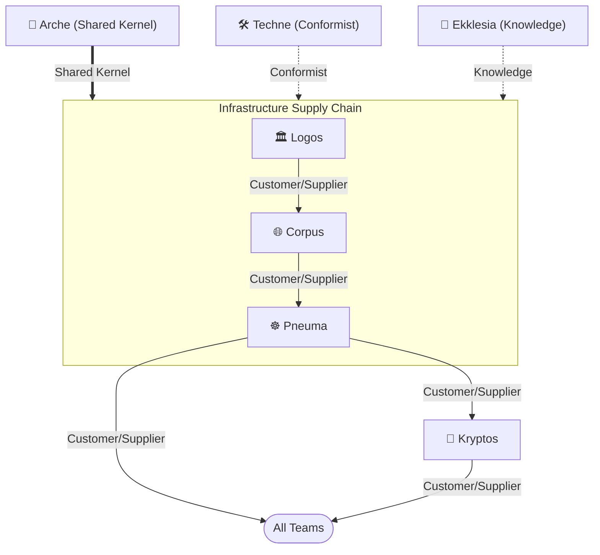

import Card from '@site/src/components/Card';
import CardGrid from '@site/src/components/CardGrid';

# Platform Teams

Platform teams provide the foundational infrastructure and tooling that stream-aligned teams depend on. Each team owns a distinct bounded domain within the platform.

<CardGrid>
  <Card item={{ icon: '🏛️', title: 'Logos', note: 'The foundational principle of order across systems — integrating multi-provider infrastructure, establishing boundaries, governance, and stable standards for teams to operate autonomously.', link: '/platform-teams/logos', linkText: 'Learn more →' }} />
  <Card item={{ icon: '🌐', title: 'Corpus', note: 'The embodiment of that order — the structural form where networks, shared services, and core infrastructure take shape, preparing the body that Pneuma will animate.', link: '/platform-teams/corpus', linkText: 'Learn more →' }} />
  <Card item={{ icon: '☸️', title: 'Pneuma', note: 'The breath of life animating the platform via Kubernetes — orchestrating dynamic, self-healing, and scalable services atop the Logos foundation.', link: '/platform-teams/pneuma', linkText: 'Learn more →' }} />
  <Card item={{ icon: '🧱', title: 'Arche', note: 'The origin and first cause — the primordial source from which all platform foundations draw their initial form and essential nature.', link: '/platform-teams/arche', linkText: 'View modules →' }} />
  <Card item={{ icon: '📖', title: 'Ekklesia', note: 'The assembly of the called-out — where distinct capabilities are gathered into a unified body, deliberating and acting in concert toward shared platform purpose.', link: '/platform-teams/ekklesia', linkText: 'Learn more →' }} />
  <Card item={{ icon: '🔐', title: 'Kryptos', note: 'The hidden foundation of platform security — managing cryptographic primitives, secrets infrastructure, and security controls that underpin all teams on the platform.', link: '/platform-teams/kryptos', linkText: 'Learn more →' }} />
  <Card item={{ icon: '🛠️', title: 'Techne', note: 'The practiced art of making — the disciplined craft through which raw materials of infrastructure are shaped into purposeful, refined platform instruments.', link: '/platform-teams/techne', linkText: 'Learn more →' }} />
</CardGrid>

## Domain

The platform is organized into bounded domains — each team owns one with explicit upstream/downstream relationships.

### Context Map

The primary flow is a **Customer/Supplier** chain — Logos supplies team and identity data to Corpus, which supplies networking and project infrastructure to Pneuma.

