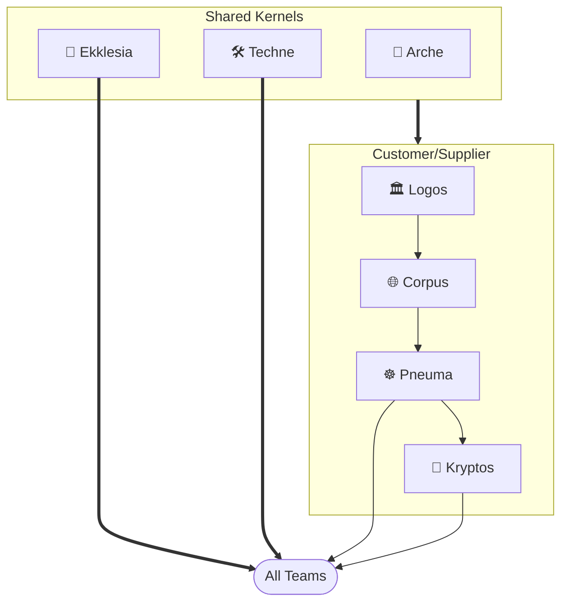

import Card from '@site/src/components/Card';
import CardGrid from '@site/src/components/CardGrid';

# Platform Teams

Platform teams provide the foundational infrastructure and tooling that stream-aligned teams depend on. Each team owns a distinct bounded domain within the platform.

## Teams

<CardGrid>
  <Card item={{ icon: '🏛️', title: 'Logos', note: 'The foundational principle of order across systems — integrating multi-provider infrastructure, establishing boundaries, governance, and stable standards for teams to operate autonomously.', link: '/platform-teams/logos', linkText: 'Learn more →' }} />
  <Card item={{ icon: '🌐', title: 'Corpus', note: 'The embodiment of that order — the structural form where networks, shared services, and core infrastructure take shape, preparing the body that Pneuma will animate.', link: '/platform-teams/corpus', linkText: 'Learn more →' }} />
  <Card item={{ icon: '☸️', title: 'Pneuma', note: 'The breath of life animating the platform via Kubernetes — orchestrating dynamic, self-healing, and scalable services atop the Logos foundation.', link: '/platform-teams/pneuma', linkText: 'Learn more →' }} />
  <Card item={{ icon: '🧱', title: 'Arche', note: 'The origin and first cause — the primordial source from which all platform foundations draw their initial form and essential nature.', link: '/platform-teams/arche', linkText: 'View modules →' }} />
  <Card item={{ icon: '📖', title: 'Ekklesia', note: 'The assembly of the called-out — where distinct capabilities are gathered into a unified body, deliberating and acting in concert toward shared platform purpose.', link: '/platform-teams/ekklesia', linkText: 'Learn more →' }} />
  <Card item={{ icon: '🔐', title: 'Kryptos', note: 'The hidden foundation of platform security — managing cryptographic primitives, secrets infrastructure, and security controls that underpin all teams on the platform.', link: '/platform-teams/kryptos', linkText: 'Learn more →' }} />
  <Card item={{ icon: '🛠️', title: 'Techne', note: 'The practiced art of making — the disciplined craft through which raw materials of infrastructure are shaped into purposeful, refined platform instruments.', link: '/platform-teams/techne', linkText: 'Learn more →' }} />
</CardGrid>

## Domain

The platform is organized into bounded domains — each team owns one with explicit upstream/downstream relationships.

### Context Map

The primary flow is a **Customer/Supplier** chain — Logos supplies team and identity data to Corpus, which supplies networking and project infrastructure to Pneuma.

### Cognitive Load

Team Topologies distinguishes three types of cognitive load — **intrinsic** (inherent domain complexity), **extraneous** (friction from poor tooling), and **germane** (productive expertise-building). The platform is designed to eliminate extraneous load through shared automation (Arche, Techne), so each team's cognitive budget is spent entirely on intrinsic and germane load.

| Team | Working Domains | High Intrinsic Domains |
|---|---|---|
| Ekklesia | 🟢 1 / 4 | 🟢 0 / 3 |
| Techne | 🟢 2 / 4 | 🟢 0 / 3 |
| Arche | 🟢 3 / 4 | 🟢 1 / 3 |
| Kryptos | 🟢 2 / 4 | 🟡 2 / 3 |
| Logos | 🟠 4 / 4 | 🟢 0 / 3 |
| Corpus | 🟠 4 / 4 | 🟢 1 / 3 |
| Pneuma | 🔴 5 / 4 · [ADR →](/platform-teams/pneuma#pneuma-cognitive-load-mitigation) | 🟠 3 / 3 |

_🟢 within limit · 🟡 approaching · 🟠 at limit · 🔴 over limit_

### Team Capacity

Headcount is derived from the cognitive load analysis above. When operating within capacity, a team requires one domain engineer to maintain and evolve its domain. A team approaching or at its limit is a candidate for additional capacity or scope reduction. Any team flagged 🔴 over limit is the highest priority for intervention — either a second engineer, scope reduction, or tooling investment to lower extraneous load.

#### Platform Lead

A single **Platform Lead** spans all seven teams. This role does not belong to any one team — it exists above them.

Responsibilities:

- Sets the platform's technical direction and architectural standards
- Owns cross-team dependency sequencing (Logos → Corpus → Pneuma)
- Reviews and ratifies Architecture Decision Records (ADRs) across all teams
- Interfaces with stream-aligned team leads and engineering leadership
- Unblocks cross-team decisions that no single domain engineer can resolve
- Allocates capacity across staffed teams based on platform demand

#### Domain Engineers

Each staffed team has one domain engineer who owns that domain end-to-end. Pneuma is the exception — its operational surface scales with the number of clusters and stream-aligned teams consuming it.

| Team | Engineers | Role |
|---|---|---|
| Logos | 1 | Owns org structure, identity, GitHub, and Datadog team management |
| Corpus | 1 | Owns GCP projects, shared VPC, state buckets, and workload identity |
| Pneuma | 1–2 | Owns GKE clusters, service mesh, policy enforcement, and cluster add-ons |
| Kryptos | 1 | Owns secrets infrastructure, PKI, and cryptographic controls |
| Arche | — | Inner source — no dedicated engineer |
| Ekklesia | — | Inner source — no dedicated engineer |
| Techne | — | Inner source — no dedicated engineer |

**Total: 5–6 engineers + 1 Platform Lead**

#### Inner Source Model

Arche, Ekklesia, and Techne operate without dedicated engineers. Instead, they run as **inner source** repositories — open for contribution from any engineer on the platform or from stream-aligned teams.

How it works:

- Any engineer may open a pull request to an inner source repo
- Domain engineers from staffed teams (Logos, Corpus, Pneuma, Kryptos) serve as code owners and reviewers
- The Platform Lead has final approval authority on structural or architectural changes
- Stream-aligned teams can unblock themselves by contributing fixes or enhancements directly, rather than filing tickets and waiting

This model distributes platform knowledge across the organization, reduces bottlenecks on the staffed teams, and ensures inner source repos evolve with the needs of their consumers rather than on a centralized backlog.
